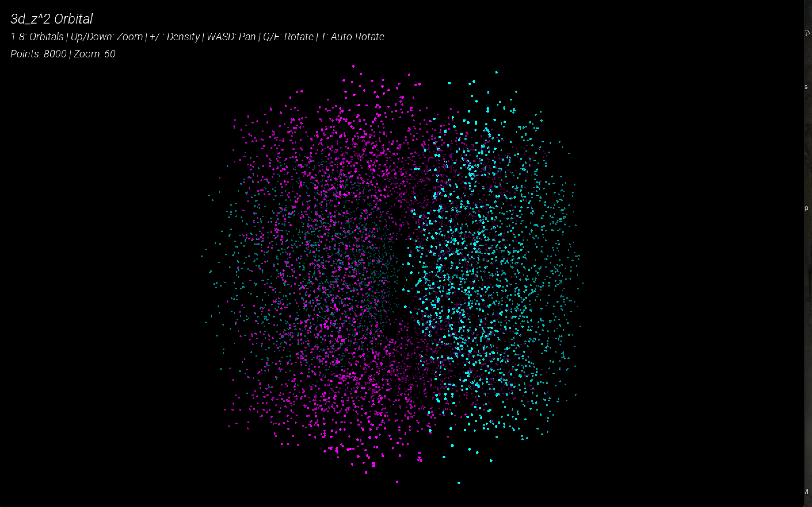

# Orbital Visualizer

A real-time molecular orbital visualization engine built in C++ with SFML.  
This project renders quantum-inspired atomic orbitals as interactive 3D point clouds with rotation, zoom, depth shading, and phase coloring.

---

## Features

- Real-time 3D orbital rendering
- Interactive camera controls
- Depth sorting and perspective projection
- Phase-colored orbital lobes
- Auto-rotation mode
- Adjustable point density
- Zoom and pan controls
- Multiple orbital visualizations:
  - 1s
  - 2s
  - 2p_x
  - 2p_y
  - 2p_z
  - 3d_x²-y²
  - 3d_xy
  - 3d_z² cross section

---

## Controls

| Key | Action |
|-----|--------|
| 1-8 | Switch orbitals |
| Up / Down | Zoom in/out |
| + / - | Increase/decrease point density |
| WASD | Pan camera |
| Q / E | Rotate vertically |
| Left / Right | Rotate horizontally |
| R | Toggle auto-rotation |

---

## Technologies Used

- C++
- SFML 3
- 3D point-cloud rendering
- Custom perspective projection
- Depth sorting algorithms

---

## Build Instructions

### Requirements

- C++17 or newer
- SFML 3

### macOS Build

```bash
g++ -std=c++17 main.cpp Orbital.cpp Renderer.cpp -o main \
-I/opt/homebrew/include \
-L/opt/homebrew/lib \
-lsfml-graphics \
-lsfml-window \
-lsfml-system
```
## Run 

./main

## Demo




